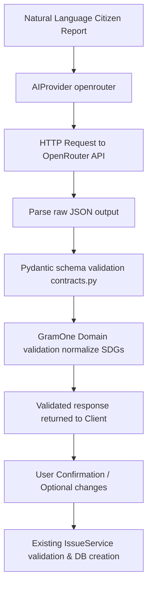

# AI Issue Intelligence Architecture

This document describes the design, pipeline, and boundary definitions of the AI Issue Intelligence system in GramOne.

---

## 1. Architectural Philosophy and Decision Boundaries

GramOne enforces a strict, absolute boundary between what the Large Language Model (LLM) is allowed to suggest versus what GramOne engines and human Panchayat administrators decide.

> [!IMPORTANT]
> **Core Principle:**
> - **AI interprets.**
> - **GramOne validates.**
> - **Deterministic engines calculate.**
> - **Human/Panchayat workflows decide.**
> 
> *The AI never provides factual certainty. It acts purely as a semantic interpreter.*

### Concern Separation

| Function / Decision | Authority | Implementation Detail |
|---|---|---|
| **Semantic Interpretation** | AI (OpenRouter) | Natural language text translation into structured JSON suggestions. |
| **Category Suggestions** | AI (OpenRouter) | Constrained suggestion mapped to `IssueCategory` enums (Water, Education, Civic, Other). |
| **SDG Suggestions** | AI (OpenRouter) | Mapped suggestion within the controlled vocabulary (`SDG1` to `SDG17`). |
| **Evidence Extraction** | AI (OpenRouter) | Identify *evidence candidates* stated in the report (not actual verification). |
| **Confidence / Certainty** | AI (OpenRouter) | Represents *model interpretation confidence* (HIGH/MEDIUM/LOW), NOT factual truth. |
| **Factual Verification** | Human Workflow | Panchayat administrators verify the issue using evidence. |
| **Impact Score & Priority** | GramOne Engine | Deterministic calculations based on population, duration, and engine rules. |
| **CSR Match Score** | GramOne Engine | Deterministic matching algorithms. |
| **Issue State Transitions** | GramOne Engine | Deterministic workflow engine transitions. |

---

## 2. Environment Configuration

All AI integration details are fully configurable and vendor-agnostic. GramOne reads configuration from environment variables locally managed in `.env` (names documented in `.env.example`).

- `AI_PROVIDER`: The selected AI provider (e.g., `openrouter`). Defaults to `unconfigured` to fail loudly if no provider is selected.
- `OPENROUTER_API_KEY`: API key for the OpenRouter provider. Kept strictly out of source code and logs.
- `OPENROUTER_MODEL`: Configured model identifier (e.g., `qwen/qwen3-30b-a3b-instruct-2507`).
- `OPENROUTER_BASE_URL`: API base endpoint for completions. Defaults to `https://openrouter.ai/api/v1`.
- `OPENROUTER_TIMEOUT_SECONDS`: Request timeout limits. Defaults to `30`.

---

## 3. Prompt Versioning & Prompts

System prompts are kept out of API routes and placed inside `backend/app/services/ai/prompts.py`. 

### Prompt Versioning
Each system prompt is assigned a unique version (e.g. `issue-interpretation-v1`). This version is returned in the structured response contract (`interpretation_version`) to track the exact prompt version that produced the interpretation, ensuring auditability.

### System Prompt Guidelines
The model is instructed with the following constraints:
1. Extract only facts directly supported by the user input; do not invent or extrapolate.
2. If info (such as affected population or duration) is not explicitly present, return `null`.
3. Distinguish explicit facts from inferences.
4. Constrain output to valid GramOne category and SDG lists.
5. Return strictly valid JSON conforming to the schema with no extra commentary or markdown formatting.

---

## 4. Structured Interpretation Schema

The output contract returned by the AI provider is defined in [contracts.py](file:///backend/app/services/ai/contracts.py). 

```python
class IssueInterpretation(BaseModel):
    category: IssueCategory
    subcategory: str | None = None
    summary: str
    affected_entity: str | None = None
    location_clues: list[str] = Field(default_factory=list)
    duration_hint: str | None = None
    urgency_suggestion: UrgencyLevel | None = None
    affected_population: int | None = Field(default=None, ge=0)
    suggested_sdg: str | None = None
    evidence_candidates: list[EvidenceCandidate] = Field(default_factory=list)
    missing_information: list[str] = Field(default_factory=list)
    explicit_facts: list[str] = Field(default_factory=list)
    inferences: list[str] = Field(default_factory=list)
    confidence: InterpretationConfidence
    interpretation_version: str = PROMPT_VERSION
```

---

## 5. Validation Pipeline

To ensure the integrity of the data store, all LLM responses go through a multi-layer validation pipeline:



1. **JSON Parsing & Markdown Sanitization**: The OpenRouter adapter cleans any markdown formatting wraps (such as ` ```json ` fences) from the output and parses it into a dictionary.
2. **Pydantic Validation**: Validates all types, checks enum matching (e.g., `IssueCategory` & `UrgencyLevel`), forbids extra fields to block data smuggling.
3. **Domain Validation**: Normalizes the suggested SDG values (e.g., lowercase `sdg6` to `SDG6` or dropping invalid values).
4. **User Confirmation**: The UI client shows the citizen what GramOne understood before final submission.
5. **IssueService Execution**: Standard `IssueService` validates the confirmed details and performs database persistence.

---

## 6. OpenRouter Adapter

The adapter `OpenRouterProvider` implements `AIProvider` in [openrouter.py](file:///backend/app/services/ai/openrouter.py):
- Calls OpenRouter via `httpx.AsyncClient` utilizing standard JSON response format.
- Disallows keys and internal secrets from leaking into application logging, errors, or API responses.
- Remains decoupled from specific model names by reading `OPENROUTER_MODEL` from the settings.

---

## 7. Failure & Fallback Behavior

The system is designed to handle failure gracefully without taking down the application:
- **Timeouts, Connection Errors, status errors (e.g., 401/429/500)**: Caught and wrapped in controlled `GramOneError` exceptions with HTTP status 502 (`ai_provider_error`).
- **Validation/Schema Failures**: Raised as controlled `ai_output_invalid` errors.
- **Secrets Protection**: All exceptions are sanitized; under no circumstances are raw OpenRouter API keys printed or returned.
- **Client Fallback**: If the AI endpoint fails, the API client falls back to presenting a standard structured form to the citizen, allowing manual issue reporting to proceed smoothly.
