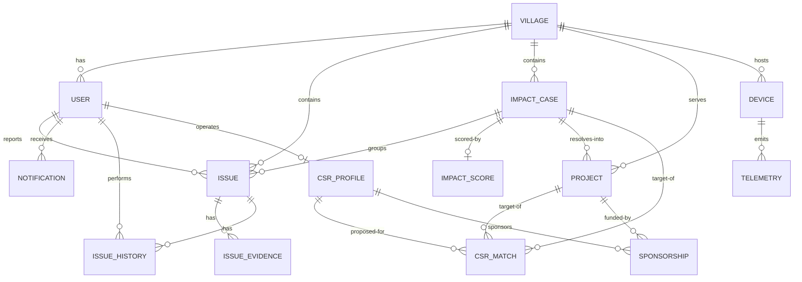

# GramOne data model

This describes the **implemented** core domain schema. The schema is owned by
the SQLAlchemy models in `backend/app/models/` and created exclusively through
Alembic (`database/migrations/`). Never hand-create tables; Alembic is the
source of truth.

## Design principle: one shared platform

GramOne is not three applications. Water, Education and Civic Infrastructure
are **domains operating on top of one platform**. A single `Issue` model carries
`category = water | education | civic | other`; there is no per-domain table, so
new domains (e.g. roads, health) extend the enum rather than the schema.

The platform spine:

```
Community / Hardware
        ↓
Issue → Evidence → Correlation → ImpactCase → ImpactScore
        ↓                                            ↓
Project ← Sponsorship ← CSRProfile ← CSRMatch       Impact tracking
```

## Core entities

| Entity | Purpose |
|--------|---------|
| **User** | An authenticated actor: `citizen`, `panchayat` or `csr` (role from `UserRole`). Owns a password hash only; auth flows are a later milestone. |
| **Village** | A GramOne-supported rural community. Users, issues, impact cases, projects and devices optionally reference one. |
| **Issue** | One reported problem in any domain. Central record for all sources (citizen, panchayat, hardware, system) and all lifecycle statuses. |
| **IssueEvidence** | A piece of evidence supporting an issue (report, Panchayat verification, telemetry-derived event, image, or a related issue). |
| **ImpactCase** | A unified real-world problem formed from multiple related issues — e.g. *Ward 4 Water Supply Crisis* aggregating several reports and a telemetry event. |
| **ImpactScore** | The deterministic, versioned scoring result for an ImpactCase, stored as an itemized component breakdown. |
| **Project** | An actionable intervention created from an ImpactCase (e.g. *Ward 4 Water Restoration*). |
| **CSRProfile** | A corporate partner: organization identity, focus areas, preferred SDGs, geography and budget appetite. |
| **CSRMatch** | A deterministic proposed match between a CSRProfile and a Project/ImpactCase, with score, scoring version and reasons. |
| **Sponsorship** | A CSR partner's funding commitment on a Project. |
| **Device** | A physical GramOne node (MVP: ESP32 `water_node`). |
| **Telemetry** | Raw sensor readings from devices — observational data only. |
| **Notification** | System messages addressed to a User. |
| **IssueHistory** | Auditable status timeline for an Issue (previous/new status, actor, note). |

## Relationships (ER)



High-level relationship principles:

- **Village is the shared anchor**: users, issues, impact cases, projects and
  devices all carry an optional `village_id`.
- **Issue → ImpactCase** is a many-to-one via `issues.impact_case_id`
  (`ON DELETE SET NULL`): an issue is created on its own, then *correlated into*
  an Impact Case by the future Correlation Engine.
- **ImpactCase → ImpactScore** is one-to-one (`impact_case_id UNIQUE`).
- **ImpactCase → Project** is one-to-many: a Case can resolve into one or more
  Projects.
- **CSRMatch** may target a Project *or* an Impact Case (a `CHECK` guarantees at
  least one is set), keeping both "match this opportunity" and "match this
  project" flows normalized on one table.
- **Sponsorship** links exactly one Project and one CSRProfile.
- **User → CSRProfile** is one-to-one (`user_id UNIQUE`) so a `csr` user's
  login maps to their organization profile.

## Why Issue and ImpactCase are separate

An **Issue** is a single problem report — one citizen, one device event, one
observation. An **ImpactCase** is the *conclusion of correlation*: several
issues that describe the same underlying real-world problem, bundled so a
stakeholder sees one actionable, scored problem instead of N fragments.

Separating them means:

- Reports can exist and be recorded **before** any correlation decision is made.
- The Correlation Engine can be re-run without destroying raw issue data.
- An ImpactCase aggregates issues lazily; issues hold no duplicated case summary.
- Impact scoring happens on the *bundle* (the case), not per report.

## Why Evidence is separate

Evidence supports an Issue and must be additive and revisable. Keeping
`IssueEvidence` out of the `Issue` row means an issue is not denormalized as
evidence accumulates, and the future Evidence Engine can reprocess confidence
from the raw evidence set at any time. Confidence is deliberately **not** a
stored fact on evidence — it is deterministic output of the Evidence Engine.

## Why Telemetry is separate from Evidence

Telemetry is **observational, raw, high-volume data** owned by the Device —
business decisions must never be encoded into it. Evidence is a *curated
domain record* tied to Issues. The intended pipeline is:

```
Telemetry → Threshold Engine → Evidence Event → Impact Case
```

Separate tables keep the raw feed append-only and cheap, while evidence
remains a lean curated link to issues.

## Project / CSR relationships

```
ImpactCase
   └── Project                        (resolution vehicle)
          ├── CSRMatch                (proposed by Matching Engine, may also
          │                            point straight at the ImpactCase)
          └── Sponsorship             (funding commitment from a CSRProfile)
```

- `CSRMatch` stores `match_score`, `scoring_version` and `match_reasons` (JSONB)
  so every recommendation is explainable and reproducible.
- `Sponsorship` carries the amount and lifecycle status
  (`pending → confirmed → active → completed → cancelled`). Payment processing
  is out of scope.

## Role relationships

`UserRole` drives who does what on the platform:

- **citizen** — reports issues, receives notifications.
- **panchayat** — owns village records, verifies issues, acts on prioritized cases.
- **csr** — linked to a `CSRProfile`; receives matches, sponsors projects.

`Issue.reported_by` accepts any user; hardware/system-generated issues may have
no reporter (`NULL`). `IssueHistory.changed_by` records the acting user or
`NULL` for system-driven transitions.

## Explainable scoring architecture

`ImpactScore` is deliberately an **itemized record**, not a single number:

- `overall_score`
- `severity_component`
- `population_component`
- `evidence_component`
- `time_component`
- `infrastructure_component`
- `scoring_version`
- `calculated_at`

The future Impact Scoring Engine computes each component deterministically and
stores the breakdown so the UI can explain *why* a score is what it is. The
weights are **configurable GramOne decision parameters, not scientifically
validated facts**, and are versioned via `scoring_version`. The same applies to
`CSRMatch.match_score` + `scoring_version` + `match_reasons`. AI is never the
authority for these numbers.

## State and enumerations

All state values live in `backend/app/models/enums.py` and are stored as
**native PostgreSQL ENUM types** so the database and the application share one
vocabulary. Enum members: user roles, issue category/source/status, evidence
type, impact case status, project status, sponsorship status, device type,
notification type. A future workflow engine will govern transitions; the schema
only *stores* status.

## Future extensibility

- **New domains**: extend `IssueCategory` (one enum value), no schema change.
- **New device kinds**: extend `DeviceType`; telemetry is sensor-agnostic.
- **New workflows**: state transition logic lives in backend engines; the
  schema already carries resolved/completed timestamps and audit history.
- **New stakeholder types**: additional roles extend `UserRole`/`AppRole`.

## Conventions

- Plural, snake_case table names; singular model names.
- All PKs are integer identities. FKs use the declared `ondelete` semantics.
- `created_at`/`updated_at` are `timestamptz` with `now()` server defaults;
  `updated_at` refreshes on UPDATE.
- Constraint and index names follow the central naming convention in
  `backend/app/db/base.py`.